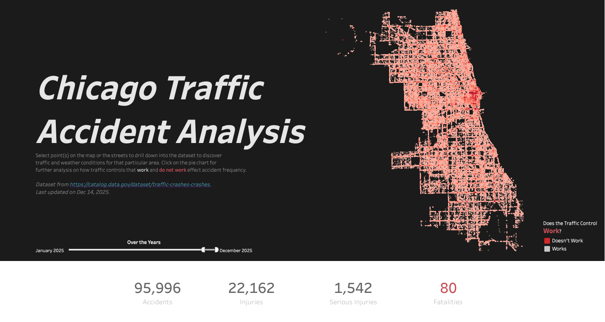
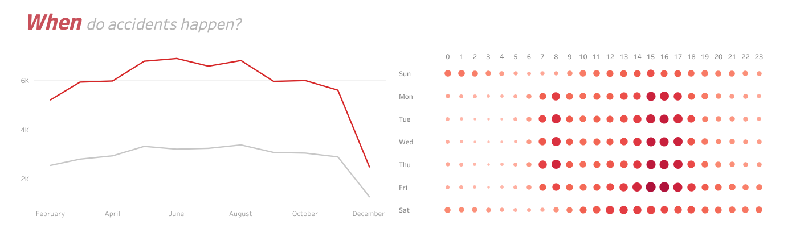
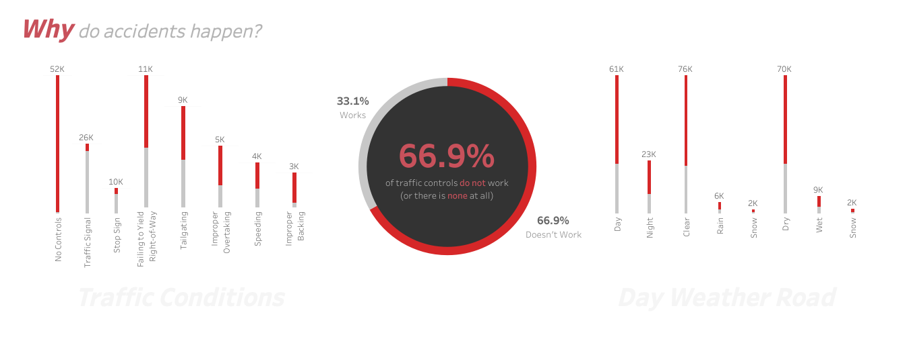
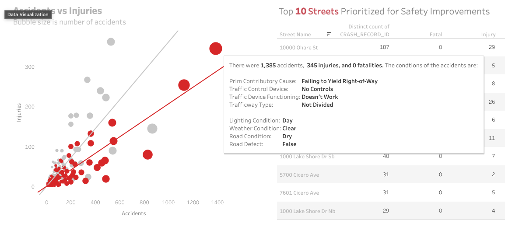
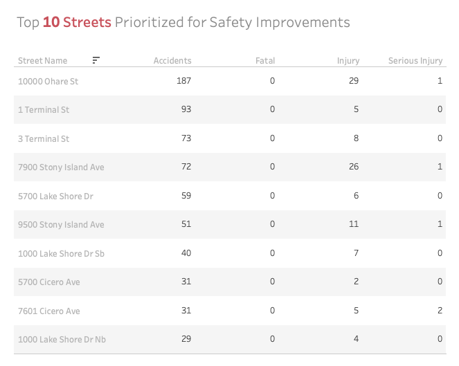
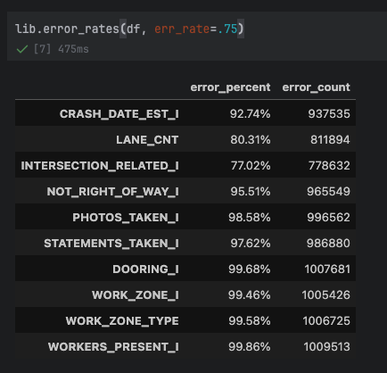

# 🚗 Chicago Traffic Accident Analysis

[](https://public.tableau.com/app/profile/christopher.magno/viz/ChicagoTrafficAccidentAnalysis/ChicagoRoadAccidentAnalysis)

## ⚒️ Tools Used
[](#) 
[](#) 
[](#) 
[](#)
[](#)
[](#) 

## 🚦 Chicago Traffic Crash Analysis (Python, Pandas, Tableau)
This project analyzes over **1 million traffic crash records** from the City of Chicago to identify patterns in accident frequency, severity, contributing factors, and high-risk locations. The objective was to demonstrate the ability to **work with large-scale, messy datasets**, perform **data wrangling and exploratory data analysis (EDA)** using **Python and pandas**, and communicate insights through **interactive Tableau visualizations**.

- **Dataset Size:** 1,010,926 rows × 48 columns (~549 MB)  
- **Tools:** Python, pandas, NumPy, Tableau  
- **Data Source:** Chicago Traffic Crashes - [data.gov](https://catalog.data.gov/dataset/traffic-crashes-crashes)

## 🎯 Objectives
- Perform large-scale data cleaning and transformation on a real-world public safety dataset  
- Identify temporal, environmental, and behavioral factors contributing to traffic crashes  
- Highlight high-risk locations for targeted safety improvements  
- Translate analytical findings into business-relevant insights using data visualization
- Automate data cleaning and transformation using Python, to enable seamless integration of dataset updates

To view the Tableau visualization, please click [here](https://public.tableau.com/app/profile/christopher.magno/viz/ChicagoTrafficAccidentAnalysis/ChicagoRoadAccidentAnalysis)
[](https://public.tableau.com/app/profile/christopher.magno/viz/ChicagoTrafficAccidentAnalysis/ChicagoRoadAccidentAnalysis)

## 🔎 Key Insights & Findings

### Crash Volume & Severity (2025)
- **95,996** total crashes  
- **22,162** reported injuries  
- **1,542** serious injuries  
- **80** fatalities  

### Temporal Patterns
- **June** has the highest monthly crash volume (**6,888 crashes**), suggesting seasonal travel impacts
- Highest crash frequency occurs on **Fridays around 3:00 PM**, aligning with post-work commute hours



## 💥 Contributing Factors
### Traffic Control Conditions
- **66.9% of crashes** occurred where **traffic control devices were absent or did not exist** (~52,000 crashes)  
- The second most common condition involved **functioning traffic signals** (~26,000 crashes), indicating congestion and driver behavior risks  



### Driver Behavior & Environmental Conditions
- Leading driver-related causes include **failure to yield the right-of-way** and **following too closely (tailgating)**  
- Most crashes occurred in **clear weather**, during **daylight**, and on **dry roads**, reinforcing that driver behavior is the dominant factor  



## 📍 High-Risk Locations
- **10000 O’Hare St** recorded the highest crash volume with **187 crashes**  
- **1 Terminal St** followed with **93 crashes**  

These locations represent priority areas for targeted **infrastructure review and safety intervention**.



## 📊 Recommendations
- Prioritize infrastructure investment in areas **lacking traffic control devices**  
- Improve optimization and placement of **traffic signals** in high-volume corridors  
- Investigate the **top 10 streets** contributing to overall crash volume to guide enforcement, signage, and roadway design improvements.

## ✏️ Data Wrangling & Preparation
To prepare the dataset for analysis and visualization, I performed extensive data cleaning and transformation:
### Dataset: 1,010,926 Rows × 48 Columns
- Removed columns with **≥75% missing values**; reviewed columns with **≥40% null rates**
  - 
- Standardized categorical values to enable cleaner, more actionable insights
```python
to_consolidate = [
    'WEATHER_CONDITION',
    'TRAFFIC_CONTROL_DEVICE',
    'DEVICE_CONDITION',
    'FIRST_CRASH_TYPE',
    'ALIGNMENT,'
    'TRAFFICWAY_TYPE',
    'ROADWAY_SURFACE_COND',
    'ROAD_DEFECT',
    'PRIM_CONTRIBUTORY_CAUSE',
    'SEC_CONTRIBUTORY_CAUSE',
    'ROADWAY_SURFACE_COND',
    'LIGHTING_CONDITION',
    'STREET_NAME', # Add this and STREET_NO together
    'STREET_NO' # Add this and STREET_NAME together
]
```
- Example: 
    - `LIGHTING_CONDITION` had multiple qualtative values *dawn, dusk, light, dark, dark with light* normalized to **Day / Night**
```python
df_cp4['LIGHTING_CONDITION'] = df_cp4['LIGHTING_CONDITION'].replace(
    {
        'DAYLIGHT': "Day",
        'DAWN': "Day",
        'DARKNESS, LIGHTED ROAD': "Night",
        'DARKNESS': "Night",
        'DUSK': "Night",
        'UNKNOWN': "NA"
    }
)
```
  - `DEVICE_CONDITION` (the **primary** metric in this analysis) has discrete qualitative values renamed to `TRAFFIC_DEVICE_FUNCTIONING` and set to use quantative `True`/`False`
```python
df_cp4['DEVICE_CONDITION'] = df_cp4['DEVICE_CONDITION'].replace(
    {
        'FUNCTIONING PROPERLY': True,
        'UNKNOWN': False,
        'NO CONTROLS': False,
        'FUNCTIONING IMPROPERLY': False,
        'OTHER': False,
        'NOT FUNCTIONING': False,
        'WORN REFLECTIVE MATERIAL': False,
        'MISSING': False,
    }
)
df_cp4 = df_cp4.rename({'DEVICE_CONDITION': 'TRAFFIC_DEVICE_FUNCTIONING'}, axis=1)
```
- Engineered features by combining fragmented fields  
  - Example: merged `STREET_NO` and `STREET_NAME` into a unified location column  
- Applied targeted null-value handling based on analytical relevance 

This process significantly reduced noise, improved consistency, and enabled efficient analysis across over one million records.

## 💼 Skills Demonstrated
- Large-scale data cleaning and transformation (**pandas**)  
- Exploratory data analysis and pattern discovery  
- Feature engineering and data quality assessment  
- Translating technical findings into **business-ready insights**  
- Data storytelling with **Tableau dashboards**