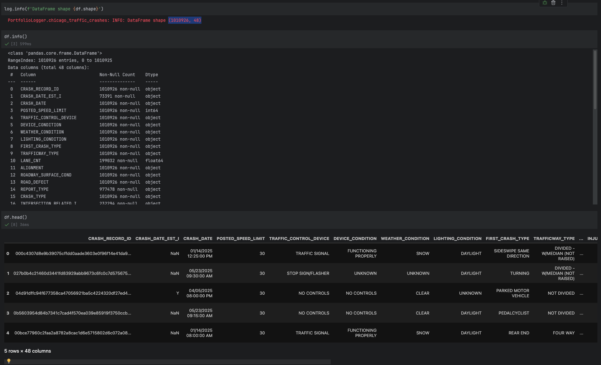

# Chicago Traffic Accident Analysis


I wanted a project where I would handle more rows of data to see the power of **_Python_** and `pandas` to see how well I can clean the data up.
I also wanted a data exploration project to see what information I can find from all of these rows of data which is why
I chose this dataset.
For this dataset, there are 1,010,926 rows and 48 columns with a file size of 549 MB. 
You can find the dataset [here](https://catalog.data.gov/dataset/traffic-crashes-crashes).

To view the Tableau visualization, please click [here](https://public.tableau.com/app/profile/christopher.magno/viz/ChicagoTrafficAccidentAnalysis/ChicagoRoadAccidentAnalysis)

## Here are my findings

In the year **2025** there were **95,996** accidents, **22,162** recordable injuries, **1,542** serious injuries, and **80** fatalities.
The highest frequency of accidents usually happen on Friday at around 3 P.M. right after work with **~1,328** accidents 
and **June** being the highest month with **6,888** accidents. 

### Why do the accidents happen?
_**66.9%**_ of accidents happen because there are **no traffic control** or the traffic controls **do not exist** with just about 
**52,000** accidents. This is a key contributing factor to accidents and represents an opportunity for improvement.
The second reason is at a working Traffic signal with **~26,000** accidents. 


### The Primary Driver Cause and Conditions
The primary cause for driver behavior is
**failing to yield the right-of-way** which makes sense since there would be confusion on the drivers part when there
are no working traffic controls to help facilitate traffic flow. For conditions the weather is usually **clear**, during 
the **day**, and on a **dry road**.


### The top street to prioritize for safety improvements
The street with the most accidents **10000 Ohare St** with **187** accidents while the 2nd street with the most accidents is 
**1 Terminal St** with **93** accidents. These are areas that could use further investigation to drastically reduce 
accident frequency.


### Recommendations
* Allocate budget to focus efforts on areas where the traffic control does not work or does not exist
* Working traffic controls will help facilitate flow of traffic to reduce confusion and thereby reducing accident freuency
* Take a look at the top 10 streets that contribute to the overall accidents

## The Data
### 1010926 rows and 48 columns and the data is _messy_


### Columns that had an error rate of 75% or more (these were dropped)


### After looking through the columns I created a few lists to parse and cleanup
```python
to_drop = [
    'BEAT_OF_OCCURRENCE',
    'MOST_SEVERE_INJURY', # Repeated in other INJURY_* columns
    'CRASH_HOUR',  # repeated in CRASH_DATE
    'CRASH_DAY_OF_WEEK',  # repeated in CRASH_DATE
    'CRASH_MONTH',  # repeated in CRASH_DATE
    'NUM_UNITS', # Would need clarification what this means
    'LOCATION'
]

# Convert to Timestamp
to_datetime = [
    'CRASH_DATE',
    'DATE_POLICE_NOTIFIED',
]

# These columns have many different classifications that could be simplified (i.e. dusk, dawn, light, dark, dark with
# light could be consolidated to "Day" and "Night")
to_consolidate = [
    'WEATHER_CONDITION',
    'TRAFFIC_CONTROL_DEVICE',
    'DEVICE_CONDITION',
    'FIRST_CRASH_TYPE', #?
    'ALIGNMENT,'
    'TRAFFICWAY_TYPE',
    'ROADWAY_SURFACE_COND',
    'ROAD_DEFECT',
    'PRIM_CONTRIBUTORY_CAUSE',
    'SEC_CONTRIBUTORY_CAUSE',
    'ROADWAY_SURFACE_COND',
    'LIGHTING_CONDITION',
    'STREET_NAME', # Add this and STREET_NO together
    'STREET_NO'

]

to_bools_manual = [
    'REPORT_TYPE', # Change to ON_SCENE
    'CRASH_TYPE', # Change to CRASH_SEVERE
    'HIT_AND_RUN_I'
]

to_ints_manual = [
    'DAMAGE'
]

to_ints = [
    'INJURIES_TOTAL',
    'INJURIES_FATAL',
    'INJURIES_INCAPACITATING',
    'INJURIES_NON_INCAPACITATING',
    'INJURIES_REPORTED_NOT_EVIDENT',
    'INJURIES_NO_INDICATION'
]

# No need to check these
valid = [
    'POSTED_SPEED_LIMIT',
    'STREET_DIRECTION',
    'LATITUDE',
    'LONGITUDE',
]

keys2 = to_consolidate + to_bools_manual + to_ints_manual + to_ints + to_datetime + to_drop + valid
diff = set(df_cp2.columns).difference(set(keys2))
log.debug(f'Diff {diff}: {df_cp2.shape[1]}/{len(keys2)}')
```