# 🏥 Healthcare Scheduling & Financial Analytics

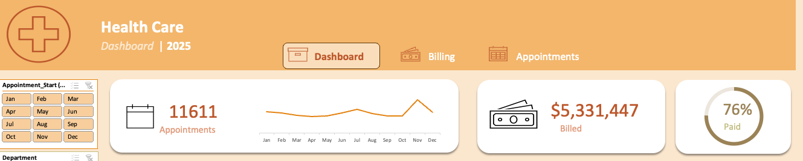

## ⚒️ Tools Used
[](#) 
[](#) 
[](#) 
[](#) 
[](#) 
[](#) 
[](#) 
[](#) 
[](#) 
[](#) 
[](#) 
[](#)
[](#)

## 📌 Overview
This project analyzes a simulated healthcare dataset (generated by **Chat GPT**) to evaluate **appointment demand, provider workload, patient behavior, and financial performance**. The objective is to demonstrate how healthcare operational and financial data can be transformed into actionable insights that support staffing decisions, patient engagement strategies, and revenue optimization.

Driven by Power Query, the raw xlsx file can be updated and the Dashboard and underlying data will be cleaned, transformed, and ready for new insights without further input. 

To download the raw xlsx file and interact with the Dashboard please click [here](https://github.com/christophermagno/christophermagno/raw/refs/heads/main/Projects/Health%20Care%20Analysis/Healthcare_Scheduling_Star_Schema_Working.xlsx).

---

## 🎯 Objectives
- Identify appointment trends and seasonality
- Analyze provider workload and burnout risk
- Understand patient demographics and repeat visit behavior
- Evaluate appointment outcomes and booking preferences
- Assess billing, reimbursement performance, and payer mix

---

## 🧱 Data Model
The analysis is built on a **relational star-schema** design that reflects real-world healthcare systems.

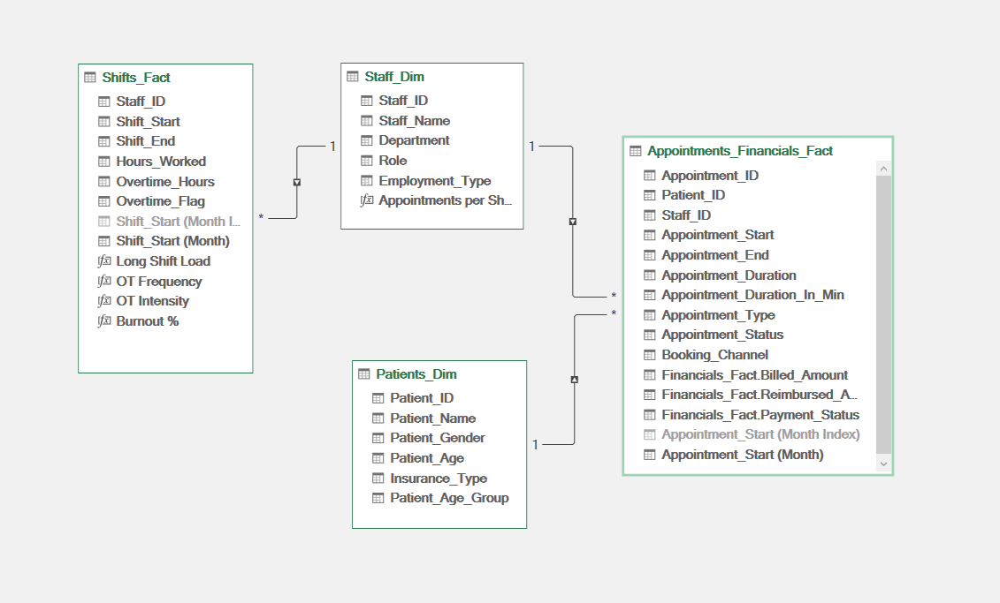

### Fact Tables
- 📅 **Appointments Fact** – scheduling data, appointment types, booking method, and appointment status  
- ⏱ **Shifts Fact** – provider shifts and workload metrics  
- 💰 **Financials Fact** – invoices, billing amounts, reimbursements, and insurance data  

### Dimension Tables
- 👩‍⚕️ **Staff Dimension** – provider identifiers and departments  
- 🧍 **Patients Dimension** – patient demographics and identifiers  

Data was cleaned and transformed using **Power Query**, with analytical measures created in **Power Pivot**.

---

## Data Wrangling, Clean up, & Transformation

Did preliminary cleaning and transformation in **Power Query**.

**Raw file**

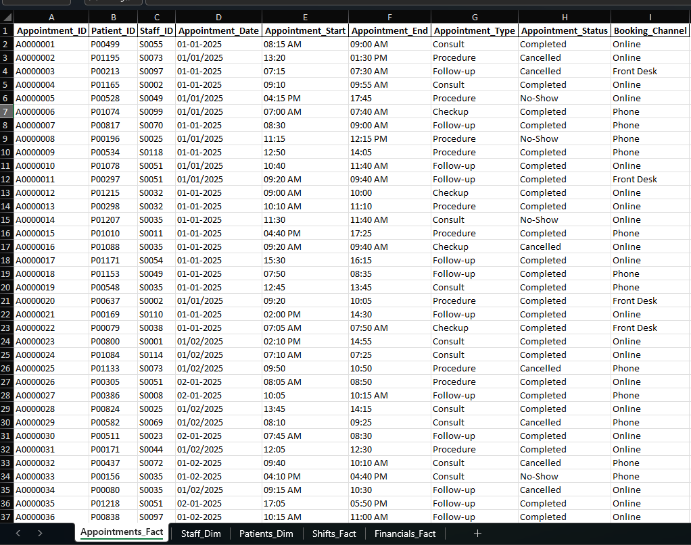

After cleaning in **Power Query**

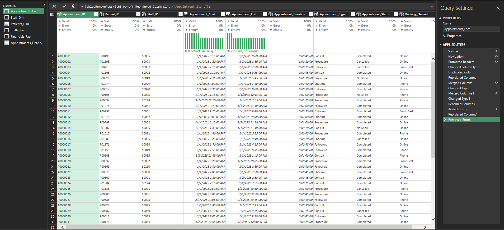

Once data has been cleaned, created a few formulas for better insights and more informative **Pivot Tables**.

### Examples
#### Shift_Facts
**Raw file**

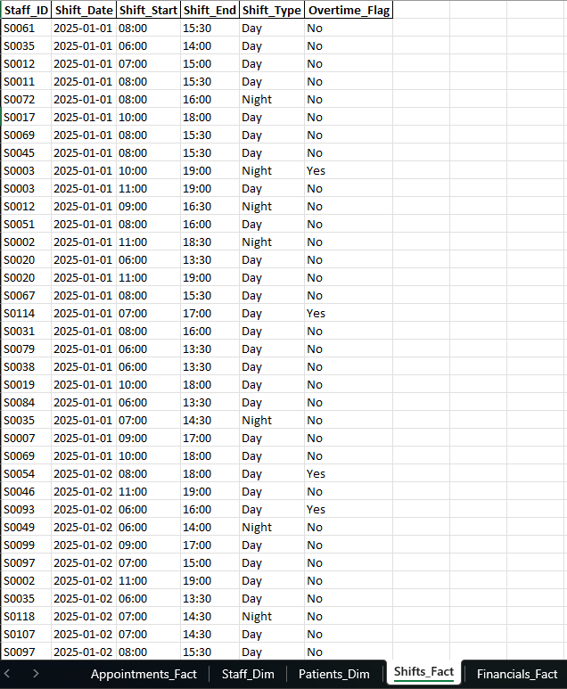

After Cleaning in **Power Query**
- Combined `Shift_Date` and `Shift_Start`/`Shift_End` for proper `Datetime` format and accessible metrics.
Formulas used

| Column Name    | Formula                                                                                | Description                                                                                                         | 
|----------------|----------------------------------------------------------------------------------------|---------------------------------------------------------------------------------------------------------------------|
| Hours_Worked   | ```=([@[Shift_End]]-[@[Shift_Start]])*24```                                            | Used transformed values and calculated hours worked for that shift.                                                 |
| Overtime_Hours | ```=(([@[Shift_End]]-[@[Shift_Start]])*24) - 'Pivot Tables'!$J$5```                    | Used a Global Variable in 'Pivot Tables'!\$J$5 (value is **7.5**) that is referenced and can easily be changed.     |
| Overtime_Flag  | ```=IF(MOD([@[Shift_End]]-[@[Shift_Start]], 1) > 'Pivot Tables'!$J$5/24+0.01, 1, 0)``` | A **0** (didn't work overtime) or **1** (worked overtime) flag to indiciate if the provider worked overtime or not. |

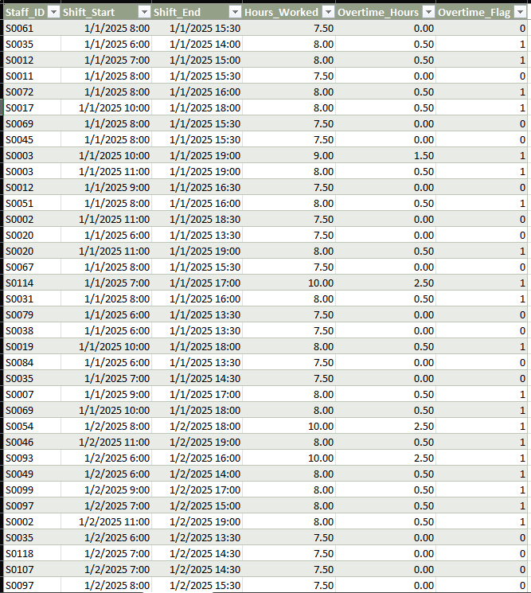


#### Patients_Dim
**Raw File**

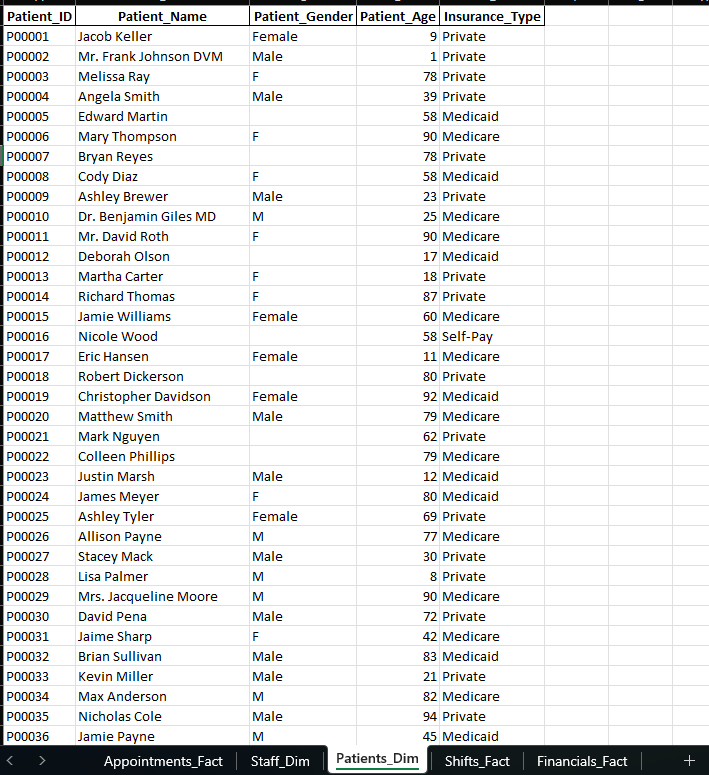

Ensured proper casing and normalized values in **Power Query**
Formulas used

| Column Name       | Formula                                                                                                                                                                                                                                                       | Description                          | 
|-------------------|---------------------------------------------------------------------------------------------------------------------------------------------------------------------------------------------------------------------------------------------------------------|--------------------------------------|
| Patient_Age_Group | ```=IF(OR([@[Patient_Age]]="",[@[Patient_Age]]<0,[@[Patient_Age]]>110),"Unknown", IF([@[Patient_Age]]<18,"-18", IF([@[Patient_Age]]<35,"18–34", IF([@[Patient_Age]]<50,"35–49", IF([@[Patient_Age]]<65,"50–64", IF([@[Patient_Age]]<80,"65–79","80+"))))))``` | Created age group bins for patients. |

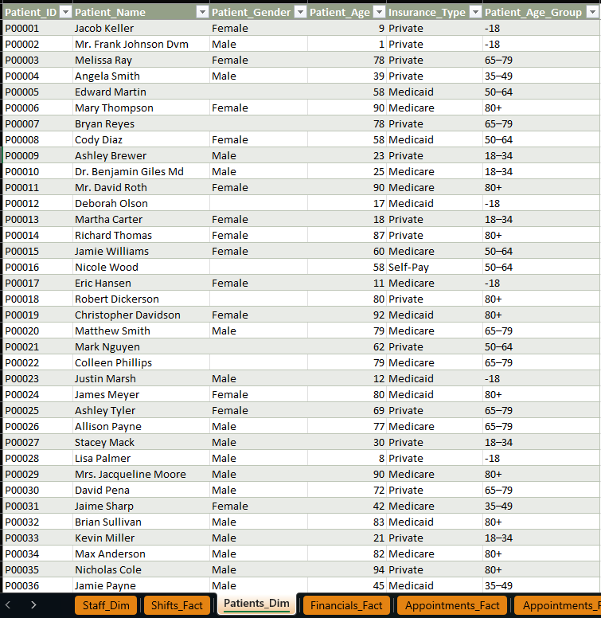

---

## 🔍 Key Analyses and Findings

### 🗓 Appointment Trends
- Appointment volume shows clear seasonality
- A **significant spike occurs in November**, likely driven by end-of-year insurance utilization

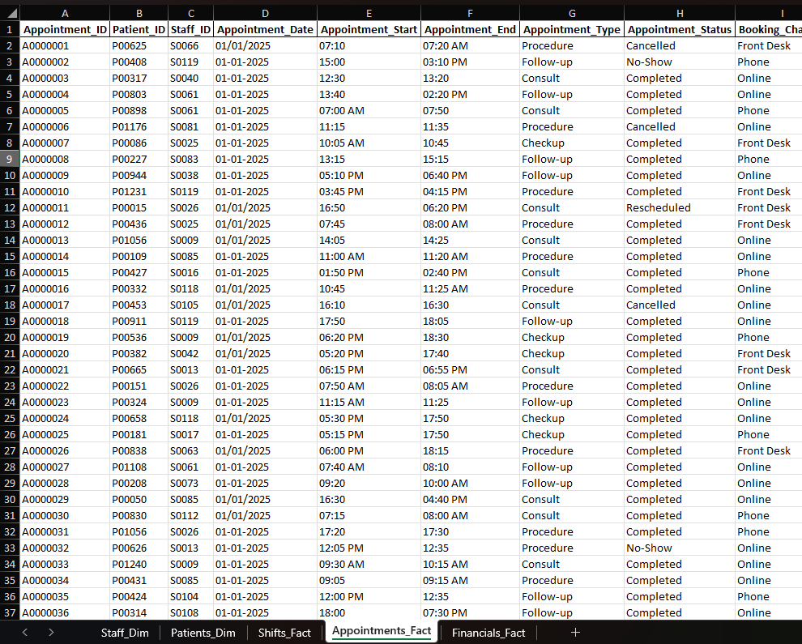

**Business Impact:**  
Supports proactive staffing and scheduling adjustments during peak demand periods.

---

### 👩‍⚕️ Providers and Departments
- Total count of providers and departments
- Provider distribution by department
- **Top 10 providers by number of shifts worked**
- Provider-level analysis of:
  - Appointments handled
  - Revenue generated
  - Workload concentration indicating **burnout risk**

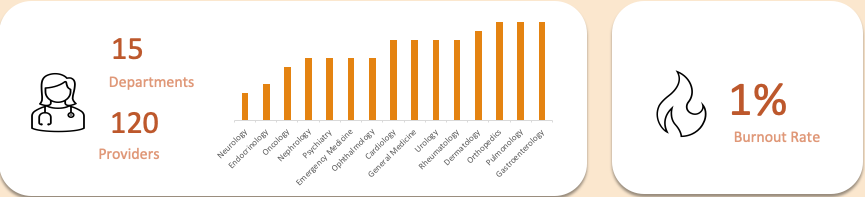

### Pivot Table
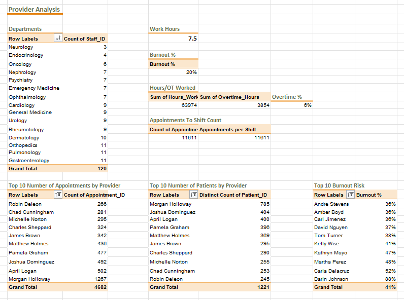

**Business Impact:**  
Identifies staffing imbalances and highlights providers at risk of overload.

---

### 🧍 Patient Demographics and Utilization
- Total patient count
- Breakdown by:
  - Age group
  - Gender
  - Average patient age
- **Top 10 returning patients** by appointment count

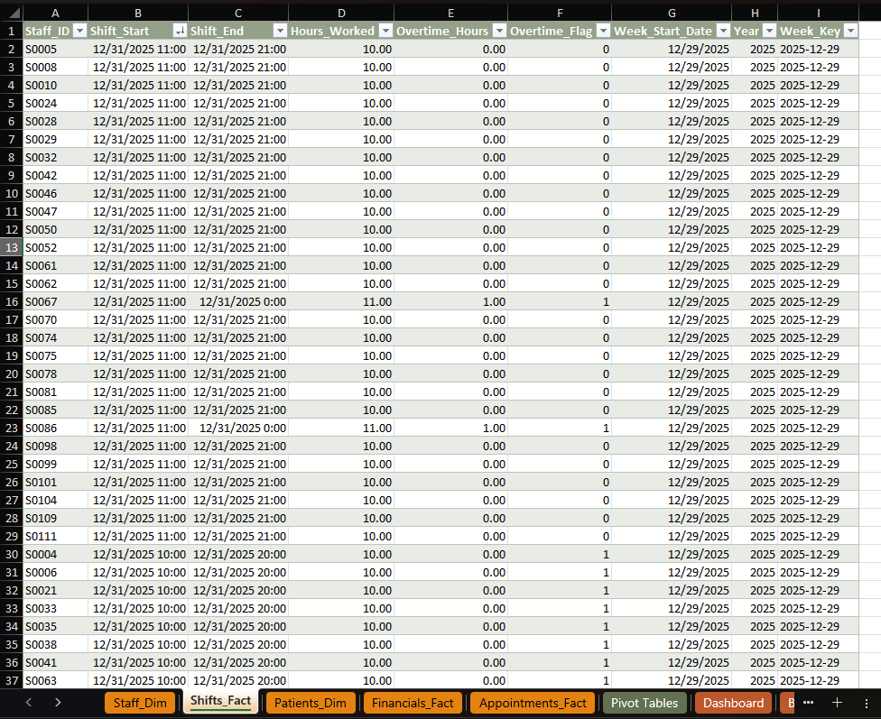

### Pivot Table
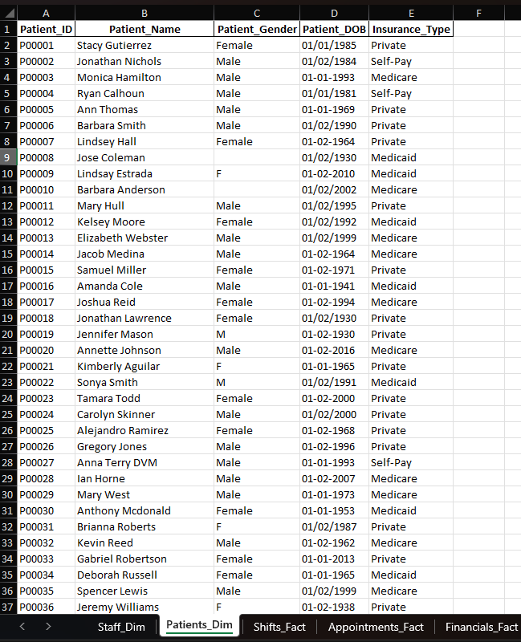

**Business Impact:**  
Highlights population characteristics and flags repeat visit patterns that may warrant further clinical or care coordination review.

---

### 🗓️ Appointment Analysis
A comprehensive analysis on scheduled Appointments ranging from cancelled and no-shows, booking method effectievness, appointment distribution, burnout rate, and top returning patients.

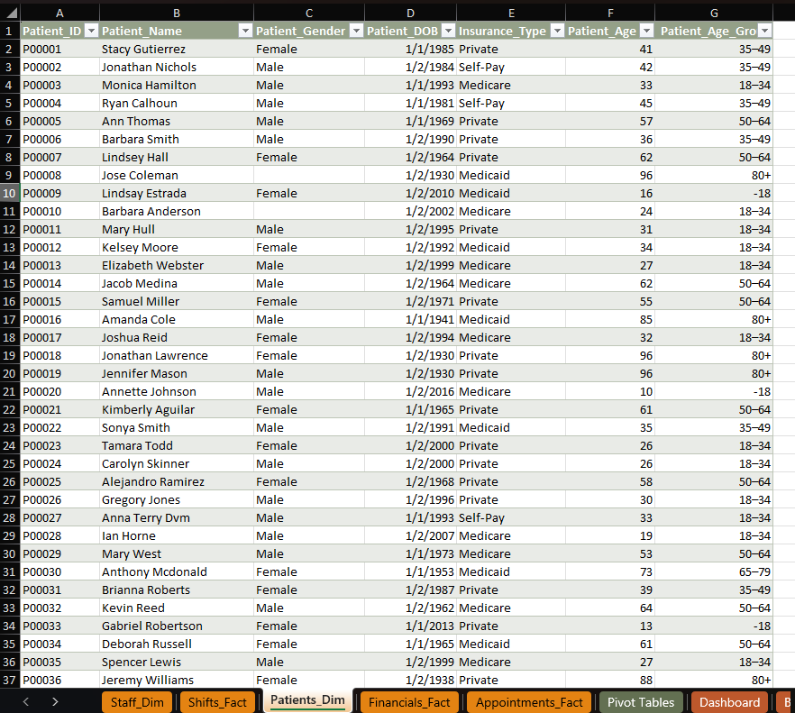

#### Pivot Table
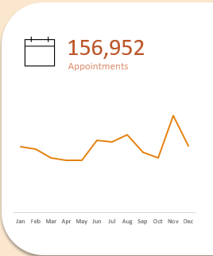

#### 🚫 Appointment Outcomes
  - ❌ Cancelled appointments
  - 🚫 No-show appointments 
  - 🔍 No-show Analysis by Gender and Age Group

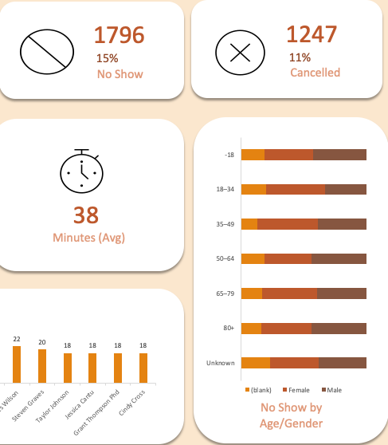

### No Show Analysis Pivot Table
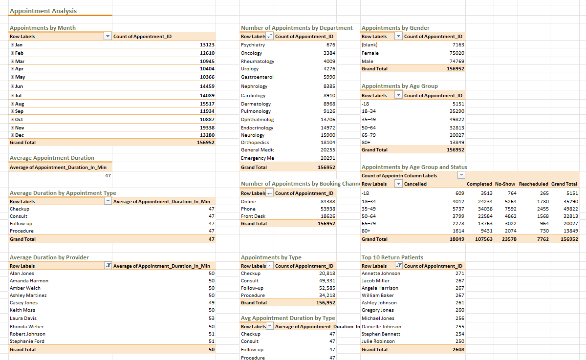

**Business Impact:**  
Quantifies operational inefficiencies and potential revenue loss due to missed appointments.

---

#### 📱 Booking Method Analysis
Appointment booking methods analyzed:
- 💻 Online
- ☎️ Phone
- 🧾 Front desk

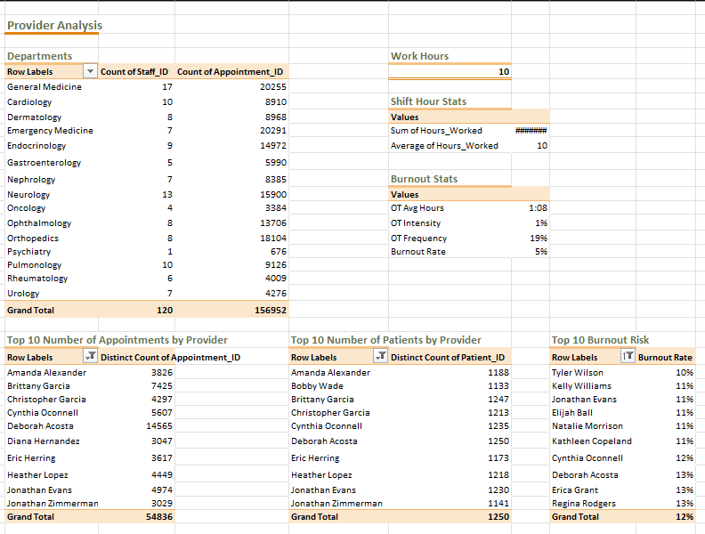

**Key Insight:**  
Online booking is the dominant scheduling method.

**Business Impact:**  
Supports continued investment in digital self-service scheduling and reduced front-desk operational load.

---

#### 🩺 Appointment Type Distribution
Appointment demand analyzed by type:
- 🩺 Check-up
- 💬 Consultation
- 🔁 Follow-up
- 🛠 Procedure

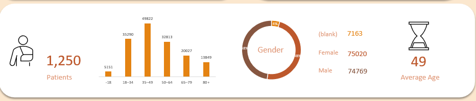

**Business Impact:**  
Helps align provider availability and specialization with patient demand patterns.

---

### 💵 Financial and Revenue Analysis
- Total invoice count
- Total billed amount
- Total reimbursed amount
- Overall **reimbursement rate**
- Invoice status breakdown:
  - ✅ Paid
  - ⏳ Pending
  - ❌ Denied
- **Top 10 providers by total revenue generated**
- Total billed amount segmented by insurance type:
  - 🏥 Medicaid
  - 👵 Medicare
  - 💼 Private insurance
  - 💵 Self-pay


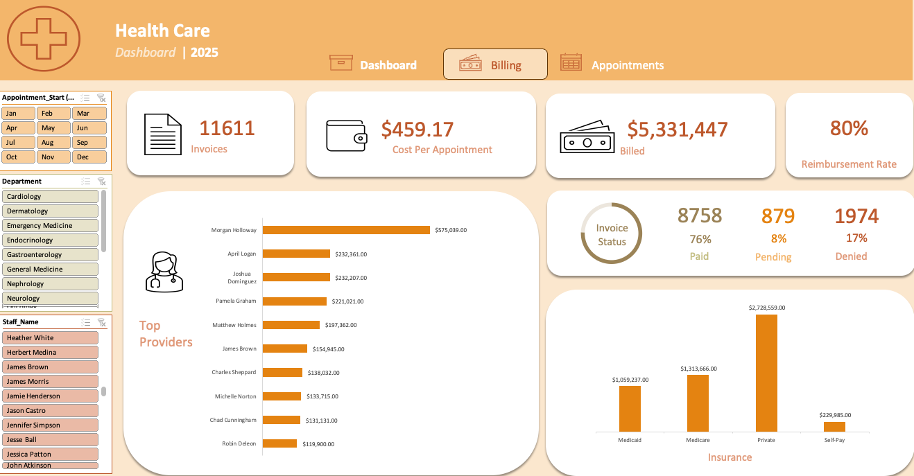

#### Pivot Table
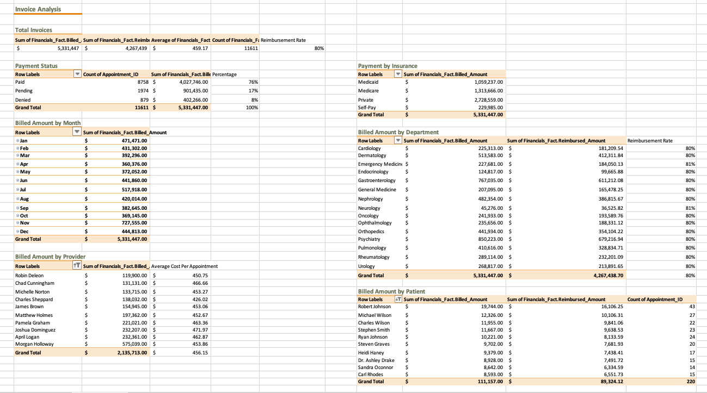

**Business Impact:**  
Provides visibility into revenue drivers, payer mix risk, and reimbursement efficiency.

---

### Slicers
These are the slicers created to modify the **Pivot Tables** in the **Dashboards**.

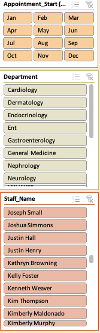

## 🧠 Key Takeaways
- Appointment demand peaks sharply in **November**
- Provider workload and revenue are concentrated among a small subset of providers
- Online booking is the preferred scheduling method
- Repeat patient behavior may indicate opportunities for improved care coordination
- Financial performance is strongly influenced by insurance mix and provider productivity
