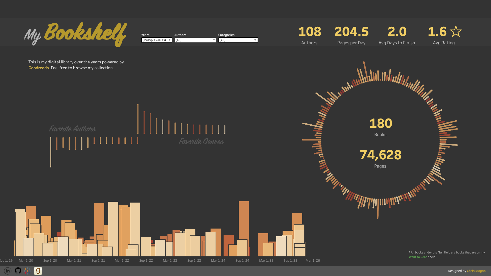
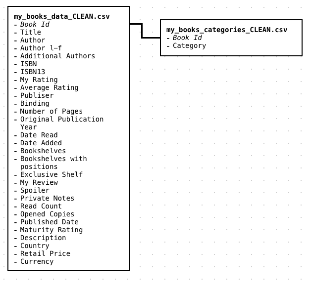
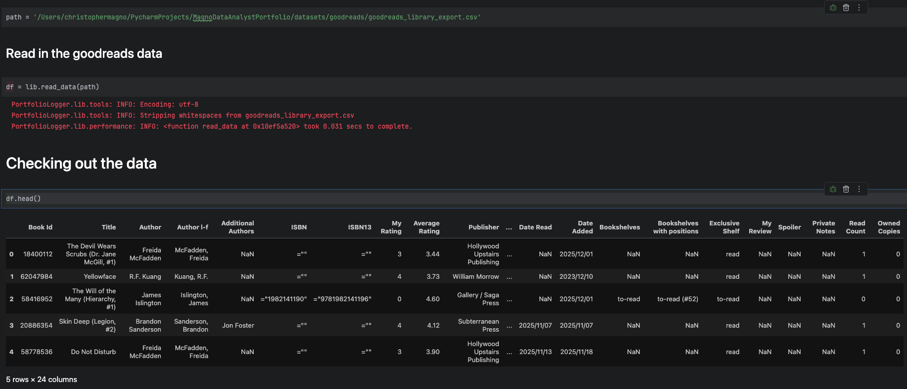
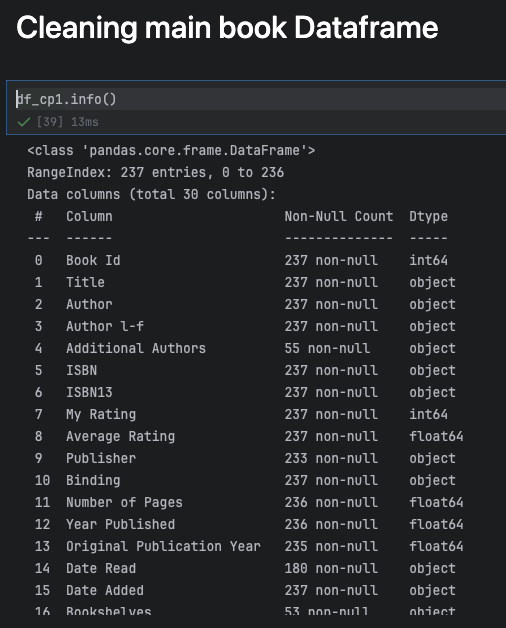

# 📚 Goodreads Bookshelf Project

[](https://public.tableau.com/app/profile/christopher.magno/viz/MyLibrary_17654594548470/MyBookshelf)

As part of a personal project, I wanted to gather my Goodreads data from their export process and explore how many books 
(and pages) I have read in a year, who my most read authors are and how many authors in general I've read, the genres I 
gravitated toward, how many pages I read per day during specific years, how long it took me to read a book, 
and my average rating for books.  

To view the Tableau visualization, please click [here](https://public.tableau.com/app/profile/christopher.magno/viz/MyLibrary_17654594548470/MyBookshelf).
[](https://public.tableau.com/app/profile/christopher.magno/viz/MyLibrary_17654594548470/MyBookshelf).

## Database Model


## ⚒️ Tools Used
* Python
  * Pandas
* Google API
* Open Library
* Tableau

## 🔎 Here are my findings

| Year | Books | Pages  | Authors Read | Pages / Day | Avg Days to Finish | Rating | Fav Author                                                      | Fav Genre      |
|------|-------|--------|--------------|-------------|--------------------|--------|-----------------------------------------------------------------|----------------|
| 2020 | 63    | 26,131 | 48           | 71.6        | 5.8 Days           | 0.0    | Frank Herbrt (6 books)                                          | Science Fiction |
| 2021 | 42    | 16,284 | 28           | 44.6        | 8.7 Days           | 0.0    | J.R.R. Tolkien, Leigh Bardugo, Andrzej Sapowski  (4 books each) | Fantasy        |
| 2022 | 14    | 11,181 | 14           | 30.6        | 15.2 Days          | 0.0    | George R.R. Martin (4 books)                                    | Fantasy        |
| 2023 | 20    | 8,438  | 15           | 23.1        | 18.3 Days          | 4.3    | Brandon Sanderson, Liu Cixin (3 books each)                     | Fantasy        |
| 2024 | 6     | 3,270  | 6            | 9.0         | 60.8 Days          | 4.0    | NA                                                              | NA             |
| 2025 | 25    | 9,324  | 18           | 25.5        | 14.6 Days          | 3.9    | Brandon Sanderson (6 books)                                     | Fantasy        |

## ✏️ Data Wrangling and Cleanup



### 238 rows and 24 columns. It came generally clean but there were a few columns that needed to be cleaned.



### The columns that needed to be cleaned

#### Fixed columns **Authors, Additional Authors, Number of Pages, and Original Publication Year, and columns with dates in them**
Filled null values with 'None'

```python
# Filled null values with "None"
df_cp1['Additional Authors'], _ = lib.fillnull(df_cp1['Additional Authors'], 'None')
lib.error_rate(df_cp1['Additional Authors'])
0.0

# Filled null values with 0 and ensure column is of type int
df_cp1['Number of Pages'], _ = lib.fillnull(df_cp1['Number of Pages'], 0)
df_cp1['Number of Pages'] = df_cp1['Number of Pages'].astype(int)
lib.error_rate(df_cp1['Number of Pages'])

df_cp1['Original Publication Year'], _ = lib.fillnull(df_cp1['Original Publication Year'], 0)
df_cp1['Original Publication Year'] = df_cp1['Original Publication Year'].astype(int)
```

#### Cast date columns to pandas Timestamp class
```python
df_cp1['Date Read'] = pd.to_datetime(df_cp1['Date Read'])
df_cp1['Date Added'] = pd.to_datetime(df_cp1['Date Added'])
df_cp1['Published Date'] = pd.to_datetime(df_cp1['Published Date'], format='mixed')
```

#### There were a few authors who's names were incorrect
```python
to_replace = {
    'Abraham   Verghese': 'Abraham Verghese',
    'Stephen        King': 'Stephen King'
}

for author, fixed in to_replace.items():
    df['Author'] = df['Author'].str.replace(author, fixed)
```

## The Goodreads dataset did not come with genres so I used GooglAPI and Open Library to generate the genres for me and stored them into their own categories dataset with the primary key _bookID_
### Created a helper function to gather genre data and additional data
```python
# A sample request
data = get_book_data(df.loc[2, 'ISBN13'])
data
{'Categories': ['Fiction', 'Genre:High Fantasy', 'Series:Hierarchy'],
 'Published Date': '2023-05-23',
 'Maturity Rating': 'NOT_MATURE',
 'Description': 'At the elite Catenan Academy, a young fugitive uncovers layered mysteries and world-changing secrets in this “brilliant and gut-churning masterpiece” (Library Journal, starred review) by the internationally bestselling author of The Licanius Trilogy, James Islington. The Catenan Republic—the Hierarchy—may rule the world now, but they do not know everything. I tell them my name is Vis Telimus. I tell them I was orphaned after a tragic accident three years ago, and that good fortune alone has led to my acceptance into their most prestigious school. I tell them that once I graduate, I will gladly join the rest of civilized society in allowing my strength, my drive, and my focus—what they call Will—to be leeched away and added to the power of those above me, as millions already do. As all must eventually do. I tell them that I belong, and they believe me. But the truth is that I have been sent to the Academy to find answers. To solve a murder. To search for an ancient weapon. To uncover secrets that may tear the Republic apart. And that I will never, ever cede my Will to the empire that executed my family. To survive though, I will still have to rise through the Academy’s ranks. I will have to smile, and make friends, and pretend to be one of them, and win. Because if I cannot, then those who want to control me, who know my real name, will no longer have any use for me. And if the Hierarchy finds out who I truly am, they will kill me.',
 'Country': 'US',
 'Retail Price': 16.99,
 'Currency': 'USD'}
```