# 🩻 Personal Health Analysis

[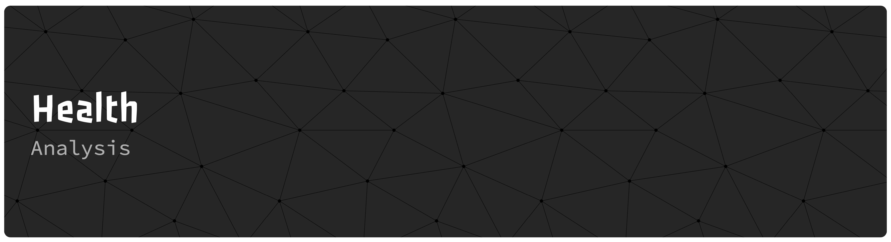](health_dataset_viz.ipynb)

## ⚒️ Tools Used
 
 

 

## 📖 Overview

This project leverages data from the [**Garmin Connect API**](https://github.com/cyberjunky/python-garminconnect) collected via my **Garmin Instinct 2** watch over the past year to analyze personal health and wellness trends. The goal of the analysis is to gain a comprehensive understanding of how my body has responded to daily activity and recovery while working in a **warehouse environment**. My hours have ranged from 5PM-~3:30AM, 5AM-~5PM, 4PM-~2:30AM with days from Sun-Wed, Tues-Sat, and Sun/Mon/Thurs/Fri.

The analysis includes data **extraction, transformation, and loading (ETL)** to clean and structure the raw Garmin data, followed by **exploratory data analysis (EDA)** using Pandas and visualizations with Matplotlib and Seaborn. By examining metrics such as **sleep, stress, heart rate, calories, steps, active hours, intensity minutes, water intake, and fitness age,** the project explores patterns in **activity, recovery, and overall physiological load.** Using data-driven visualizations and regression analysis, this project highlights relationships between activity, sleep quality, stress, and recovery to provide actionable insights into personal wellness.

To see the visualization in *matplotlib*, click [here](health_dataset_viz.ipynb)

---

## 🏋🏽‍♂️ Fitness Age

Fitness Age is a composite metric calculated by Garmin using inputs such as estimated VO₂ Max, activity intensity, resting heart rate, and BMI. It provides a normalized, age-based indicator of overall cardiovascular fitness and activity level, allowing for easier comparison of fitness trends over time.

### Key Insights
* Fitness Age fluctuates within the 30–33 year range across the observed period, indicating relatively stable fitness levels.
* Short-term increases or decreases in Fitness Age tend to align with changes in activity intensity, recovery, and resting heart rate.
* Periods of consistent activity and adequate recovery are generally associated with lower (improved) Fitness Age values.
* Fitness Age serves as a useful summary metric when evaluated alongside its contributing variables rather than in isolation.

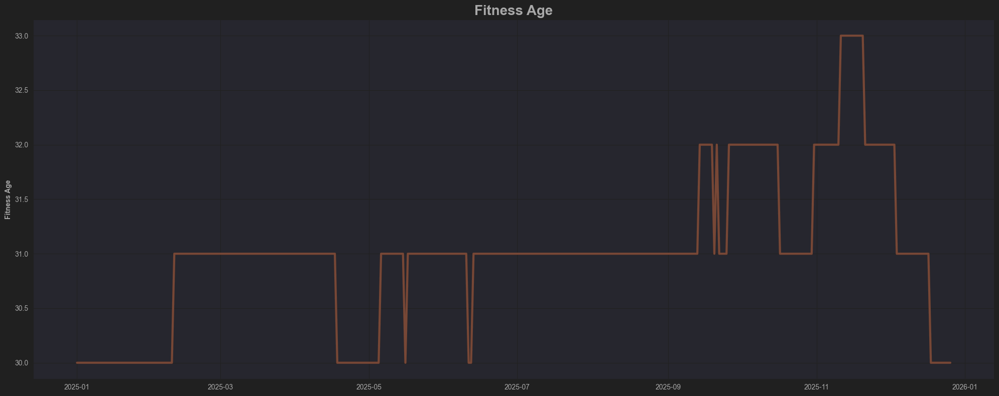

### Fitness Age Correlations

This visualization explores how Fitness Age relates to daily activity, exertion, and recovery metrics. By comparing Fitness Age against calories burned, total steps, highly active hours, and sleep score, the regression trends reveal which behaviors show stronger linear relationships with fitness outcomes.

---
Active hours show the most notable correlation with fitness age, with other factors contributing in secondary, yet important, ways.

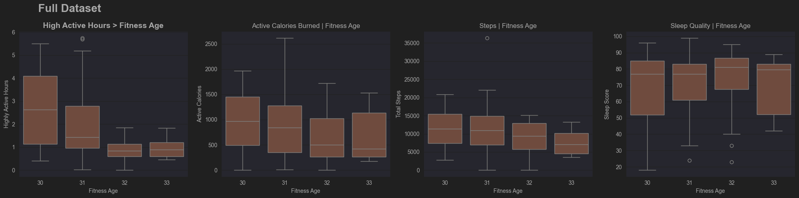
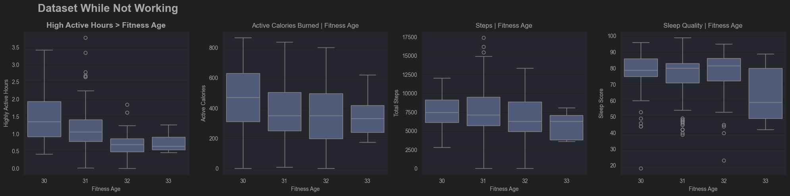
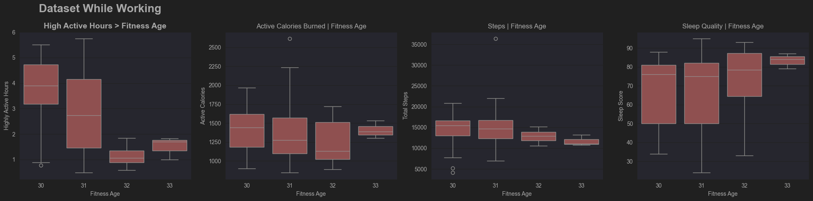

---

## 💧 How Many Cups of Water Do I Drink a Day?

Water Intake tracks daily fluid consumption and is compared against a personalized hydration goal calculated by Garmin based on factors such as height, weight, and activity level. This metric provides context for daily hydration habits and helps assess consistency relative to recommended intake levels.

### Key Insights
* The recommended daily water intake is approximately 12 cups (96 oz), based on personalized hydration guidelines.
* Average daily water consumption is approximately 10.89 cups, indicating generally consistent hydration behavior.
* While daily intake does not always meet the recommended goal, overall consumption remains close to target levels across most days.
* Periods of lower intake are balanced by consistent hydration on other days, supporting stable hydration trends over time.

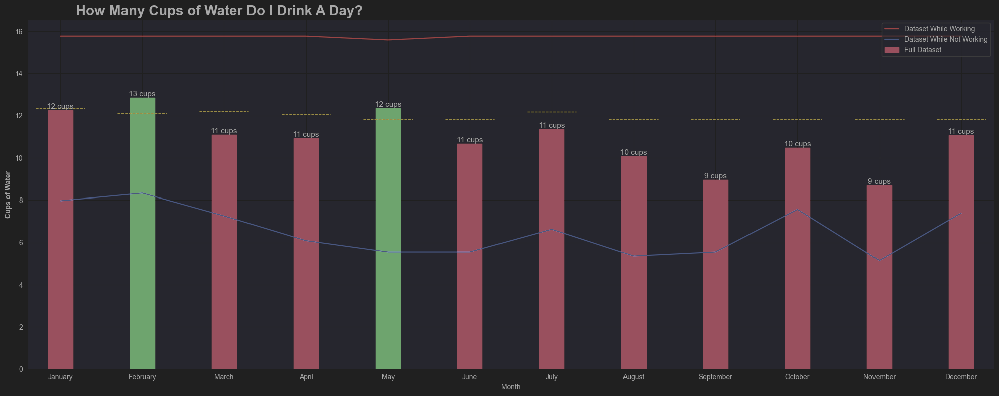

---

## 💗 Heart Rate Data

Heart rate data provides insight into cardiovascular workload, recovery, and exercise intensity. During data collection, it was observed that Garmin does not store a daily average heart rate in the general summary tables. To address this, per-minute heart rate records were scraped and aggregated to calculate daily averages. However, Garmin appears to retain this high-granularity data for a limited time period, resulting in partial coverage of average heart rate values across the full dataset.
This mimics real-world scenarios where data might not be available and has to be gathered and generated through other sources of data.

### Key Insights
* The calculated average heart rate is approximately 75 bpm, derived from per-minute heart rate data.
* Maximum recorded heart rate reached 179 bpm, typically occurring during high-intensity activity.
* Minimum heart rate values dropped to 39 bpm, reflecting periods of rest or sleep.
* Resting heart rate averages around 54 bpm, providing a baseline indicator of cardiovascular fitness and recovery.

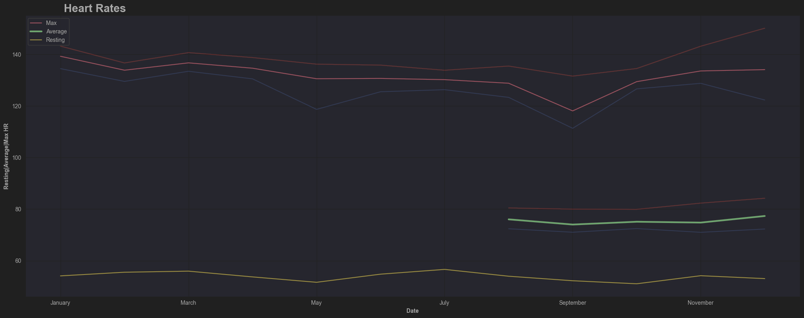

---

## 🏃🏽‍♂️ Total Calories Burned and Active/Intenity Minutes
Total Calories Burned represents daily energy expenditure, combining basal metabolic rate with calories burned through physical activity. Active Hours and Intensity Minutes capture different dimensions of movement: Active Hours reflect consistent movement throughout the day, while Intensity Minutes measure time spent in moderate to vigorous activity. Together, these metrics provide a comprehensive view of daily activity volume and exertion.
This analysis spans multiple work schedule changes throughout the year, allowing for comparison of activity and calorie expenditure patterns across different routines and days of the week.

### Key Insights
* Average daily calorie expenditure is approximately **2,357 calories**, with a maximum of **4,134 calories** on high-activity days and a minimum near **1,500 calories**, aligning closely with estimated resting metabolic rate.
* Periods of higher calorie burn align with work schedule changes, resulting in concentrated activity patterns on specific weekdays.
* Higher calorie expenditure is generally associated with increased active hours and elevated intensity minutes, reflecting both sustained movement and purposeful exercise.
* Weekly Intensity Minutes are evaluated against Garmin’s guideline of 150 minutes per week, helping assess consistency in moderate-to-vigorous activity levels over time.

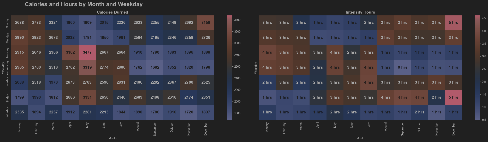
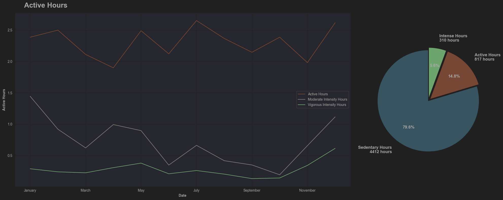
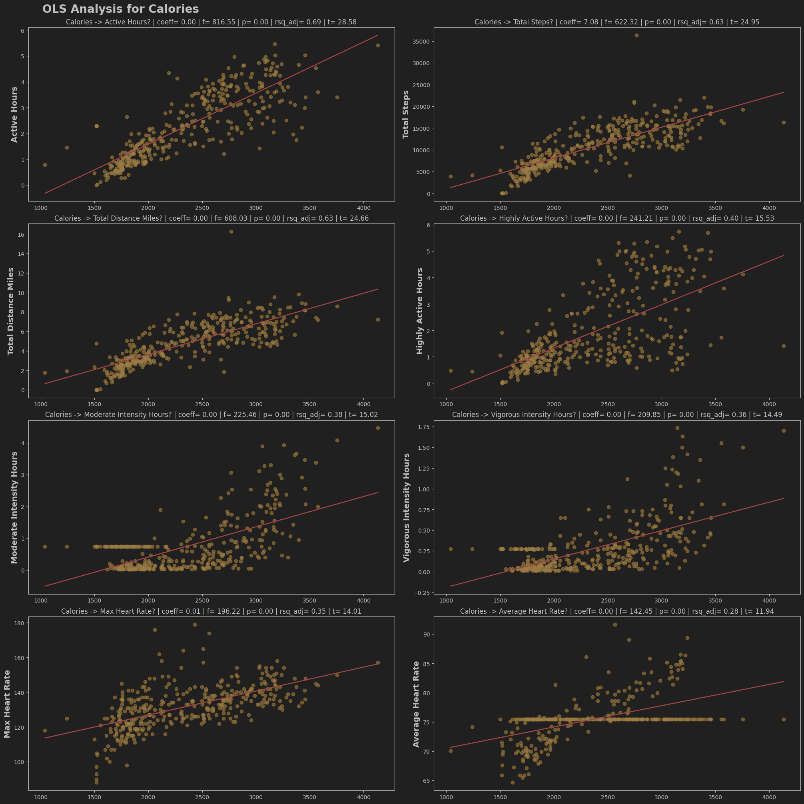

---

## 🚶🏽‍♂️ Total Steps Taken and Miles Walked
Steps Taken and Miles Walked measure overall daily movement and serve as core indicators of physical activity volume. Steps capture total movement throughout the day, while miles walked translate that activity into distance, providing additional context for activity intensity and duration. Together, these metrics help quantify daily mobility patterns and overall activity levels.

### Key Insights
* Average daily activity is approximately **10,729 steps**, indicating a consistently active baseline.
* Daily step counts vary significantly, with a maximum of **36,384 steps** recorded during a high-activity day (a long hike in the Columbia River Gorge on July 20), and a minimum of **21 steps**, representing a near-complete rest day.
* High-step days are typically associated with elevated calorie expenditure and longer active durations, while low-step days highlight periods of inactivity or recovery.
* Analyzing both steps and distance helps distinguish between frequent short movements and sustained walking or hiking sessions.
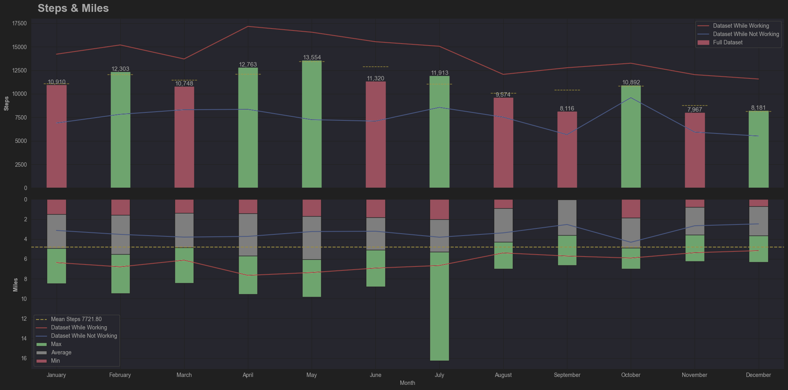
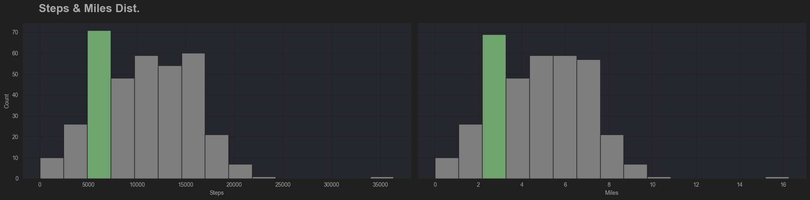

---

## 💤 Sleep

Garmin’s Sleep Duration measures the total time spent asleep between sleep onset and wake time, providing a quantitative measure of nightly rest. Sleep Score is a composite metric that evaluates overall sleep quality using sleep duration, sleep stage distribution (light, deep, and REM), overnight stress, and recovery indicators. Analyzing these metrics together allows for a clear distinction between sleep quantity and sleep quality.

### Key Insights
* Sleep duration alone does not fully explain sleep quality; longer sleep does not always result in higher sleep scores.
* Higher sleep scores tend to align with improved recovery indicators and lower stress levels.
* Variability in sleep duration across days can have a noticeable impact on overall sleep quality trends.
* Examining both metrics together provides more actionable insight than analyzing either metric in isolation.
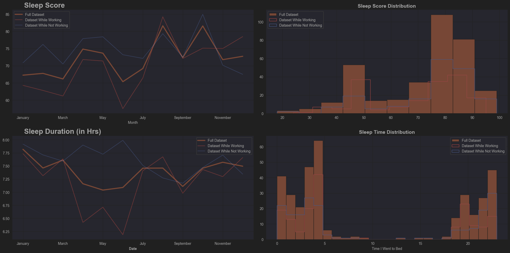

## 😴 Sleep Quality

Sleep quality is evaluated using Garmin’s Sleep Score, which incorporates sleep duration, sleep stage distribution (light, deep, REM), and recovery indicators such as body battery and overnight stress. This analysis also examines sleep timing — specifically, sleep onset and wake times — to understand how these factors relate to sleep quality and overall recovery.

Average sleep score is **72 (min 18, max 99)** with **7.39 hours** of sleep on average **(min 3, max 13.5)**.

Regression analysis reveal that longer sleep generally improves sleep score and body battery, and better sleep may support higher calorie burn. Moderate active hours (around 1-2 hours) show a positive relationship with sleep quality, but extended high-intensity activity does not necessarily improve sleep. Sleep onset and wake times also influence sleep effectiveness, highlighting the importance of consistent sleep patterns. Sleep onset and wake times also influence sleep effectiveness, with better quality sleep observed when sleeping around 9 PM (on my off days) or 3 AM (on the days I work), highlighting the importance of consistent sleep patterns. Higher stress levels are associated with lower sleep scores, highlighting the interaction between physiological stress and recovery.

### Key Insights
* Sleep onset time significantly affects sleep quality: going to bed earlier is generally associated with higher sleep scores. (I *generally* get better/consistent sleep from 9-11PM).
* Wake times and sleep consistency also contribute to overall recovery metrics.
* While moderate activity supports sleep, overly long or highly intense activity sessions do not guarantee improved sleep quality.
* Sleep score and duration provide complementary insights: duration reflects quantity, while sleep score captures quality and recovery effectiveness.

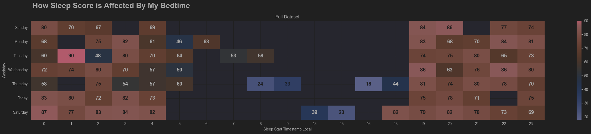
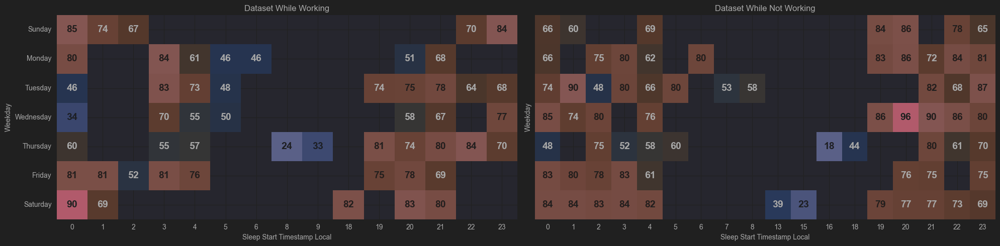
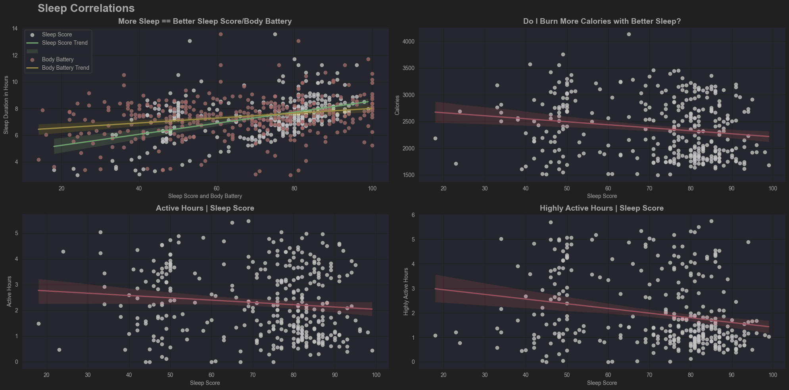
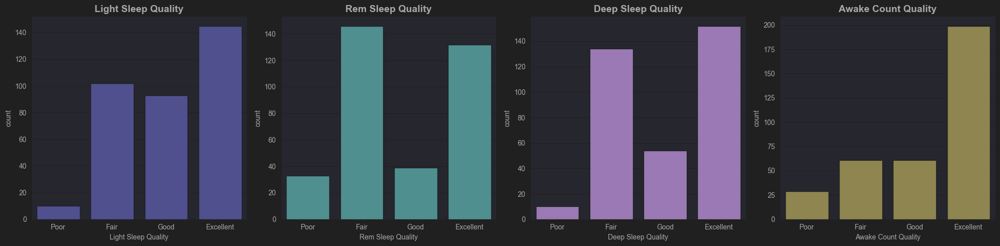
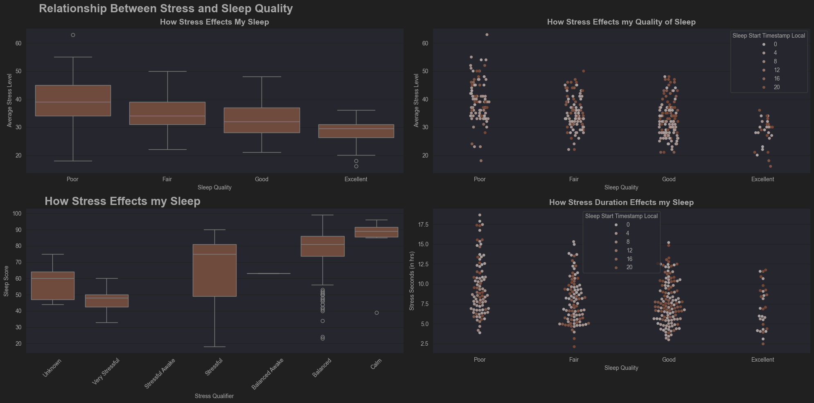

---

## 😰 Stress Data

Garmin estimates stress levels using heart rate variability (HRV) derived from optical heart rate sensors, combined with other physiological signals such as heart rate and respiration rate. The proprietary algorithm generates a body battery score and assigns a stress level throughout the day, reflecting both acute and cumulative stress. Higher stress levels correspond to lower recovery capacity and reduced body battery, while lower stress indicates better physiological readiness.

### Key Insights
* Elevated stress readings are generally associated with higher heart rate and respiration rate, and are inversely related to body battery.
* Short-term stress spikes may occur independently of activity, while prolonged stress periods tend to reduce recovery and overall wellness metrics.
* Days with lower stress levels often correspond with better sleep quality, improved recovery, and more consistent activity performance.
* Integrating stress metrics with activity, sleep, and heart rate data provides a holistic view of physiological load and recovery patterns.
* The more stressed I am, the worse sleep I get

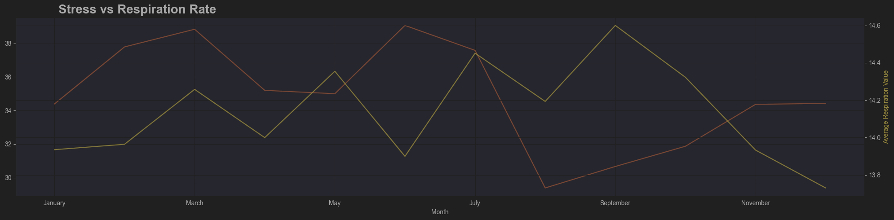
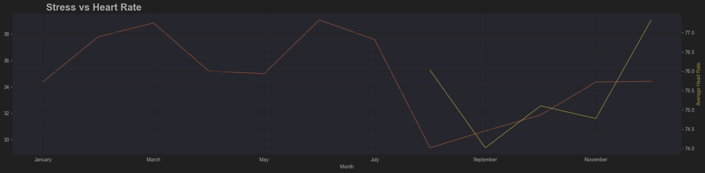
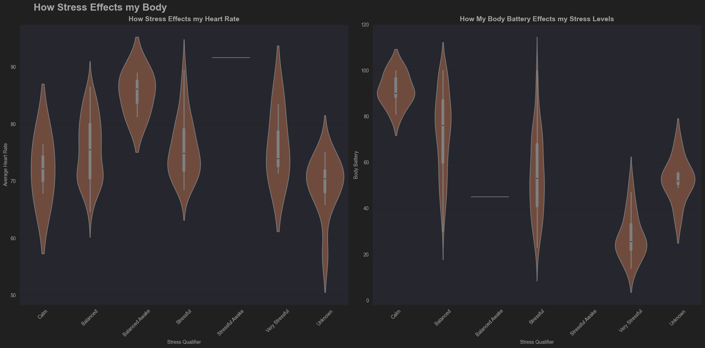