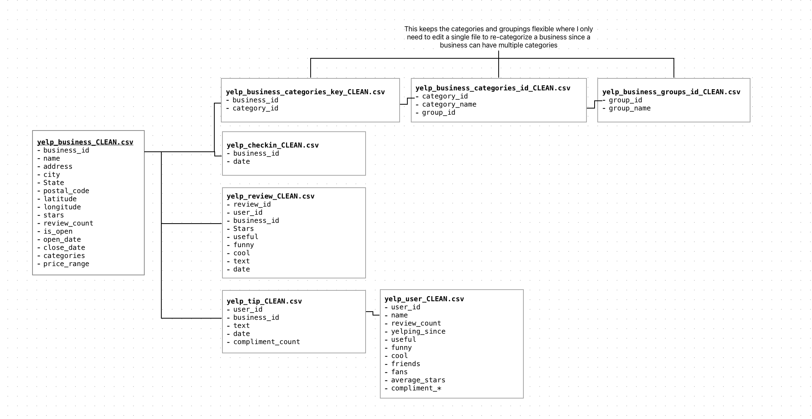
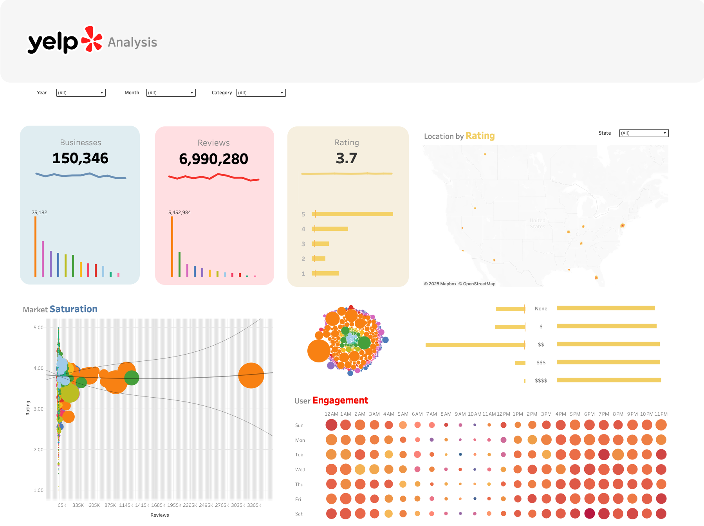

# Yelp Data Exploration

## ⚒️ Tools Used
 
 
 

 

# 🍽️ Yelp Dataset Exploratory Data Analysis (EDA)

## 📖 Project Overview
This project analyzes the **Yelp Open Dataset**, which contains millions of rows across multiple relational tables. The goal was to perform **data wrangling, exploratory data analysis (EDA), feature engineering, clustering, and visualization** to extract business insights on customer behavior, category performance, and market trends.  

- **Tools:** Python, pandas, NumPy, Tableau, scikit-learn (K-Means), NLP  
- **Dataset Size:** Multi-million row JSON tables, including business, review, check-in, user, and tip data  
- **Data Source:** [Yelp Open Dataset](https://business.yelp.com/data/resources/open-dataset/)

---

## 📊 Dataset Details

| File                                | Rows x Columns | Size     |
|-------------------------------------|----------------|----------|
| yelp_academic_dataset_business.json | 150,346 x 60   | 118.9 MB |
| yelp_academic_dataset_checkin.json  | 131,930 x 2    | 287 MB   |
| yelp_academic_dataset_review.json   | 6,990,280 x 9  | 5.34 GB  |
| yelp_academic_dataset_tip.json      | 908,915 x 5    | 180.6 MB |
| yelp_academic_dataset_user.json     | 1,987,897 x 22 | 3.36 GB  |

---

## 🎯 Project Goals
- Aggregate **total businesses, review counts, and average ratings** per region and category over time  
- Analyze **business performance by price tiers ($, $$, $$$, $$$$)**  
- Examine **user engagement trends** by day of week and hour of check-ins  
- Identify **top business categories** and consolidate them into **logical clusters using K-Means**  
- Determine **top-performing businesses per region**  
- Evaluate **market share distribution** across categories and segments  
- (Stretch) Conduct **sentiment analysis** on customer reviews and tips to extract positive/negative keywords and trends  

---

## 🧩 Data Modeling & Wrangling
- Created a **relational data model** linking business, review, check-in, user, and tip tables via **primary and foreign keys**  
- Performed extensive **data cleaning**, including handling missing values, correcting data types, and standardizing categorical fields  
- Engineered features such as **aggregate review metrics**, **average ratings per category**, and **hourly engagement metrics**  
- Consolidated ~1,300 business categories into **12 clusters** using **K-Means**, improving analytical clarity and visualization  

## Dataset Modeling

## 🔎 Key Findings
- Identified **high-performing categories** and regions based on review count, average rating, and market share  
- Revealed **peak customer engagement hours and days**, supporting operational and marketing decisions  
- Determined **top 10 businesses per region**, highlighting local market leaders  

---

## 📊 Visualization & Storytelling
- Developed **interactive Tableau dashboards** to present findings, including sparkline trends for total businesses, review counts, and rating trends  
- Dashboards highlight **business performance and market share across regions, price tiers, and categories**, providing actionable insights for strategy and decision-making  

---

## 💼 Skills Demonstrated
- Multi-table **data ingestion, cleaning, and integration** using Python and pandas  
- **Feature engineering** and metric aggregation for business performance analysis  
- **Clustering** and **unsupervised learning** (K-Means) for category consolidation  
- **Data visualization** in Tableau

## Stretch goals
* Sentiment Analysis and word cloud or negative and positive keywords on the 6.9M rows of customer reviews and tips
  * Sentiment trends over time

## Data Visualization
To view the Tableau visualization, please click [here](https://public.tableau.com/app/profile/christopher.magno/viz/YelpAnalysis_17653606827830/YelpAnalysis)
